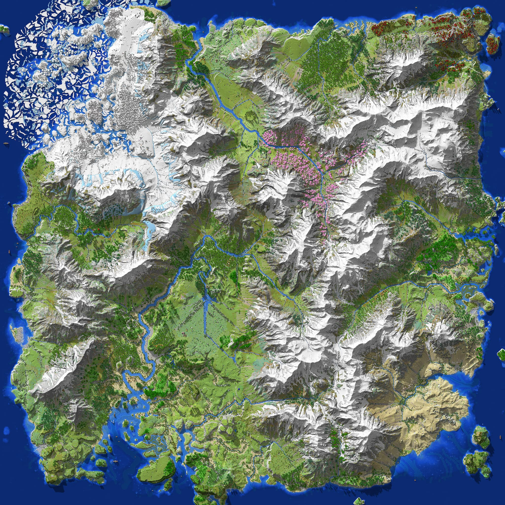

Berotorm,
an great 16km² custom Minecraft map created by McMeddon. An alpine dominated world, in a mixture style of Rocky Mountains and European Alpines. Engulfed in huge flower fields, forests and grand valleys. This world focused on the integration of those new mountains and the transition to the new world machine version.

Embark on thrilling adventures by plundering forests and balloons, battling through deserts, or constructing your dream home on cliffs or mountains. Discover custom thriving diverse island to explore.

<iframe width="100%" class="aspect-video" src="https://www.youtube.com/embed/BekMAa5B41s?si=8GQMuMKcNV_bBFVD" title="YouTube video player" frameborder="0" allow="accelerometer; autoplay; clipboard-write; encrypted-media; gyroscope; picture-in-picture; web-share" referrerpolicy="strict-origin-when-cross-origin" allowfullscreen></iframe>

---

Released	Release date	Type

✅ 03. April 2025	Source Files

✅	03. April 2025	1.20.2 Java

planned	1.21 Bedrock 

---

## Links
> https://www.planetminecraft.com/project/berotorm/

> https://www.patreon.com/posts/berotorm-4k-1-20-125832187

https://www.youtube.com/watch?v=BekMAa5B41s

## World Explorer

<!-- <iframe src="https://mcmeddon.github.io/Fetoxion/" width="100%" height="600" frameborder="0" allowfullscreen></iframe> -->

---
## Images

---
