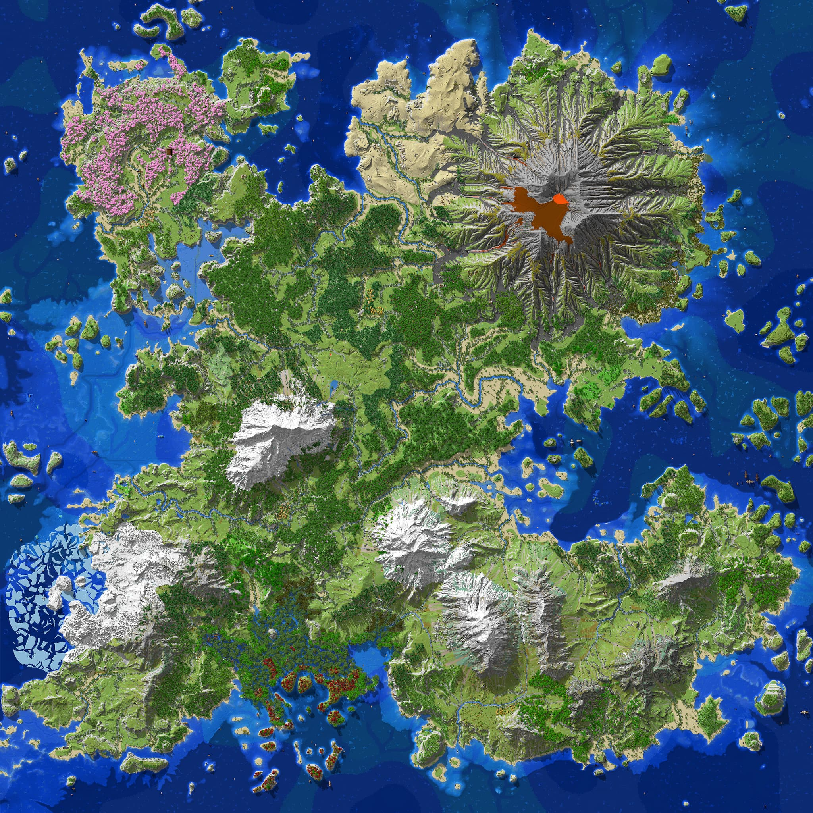
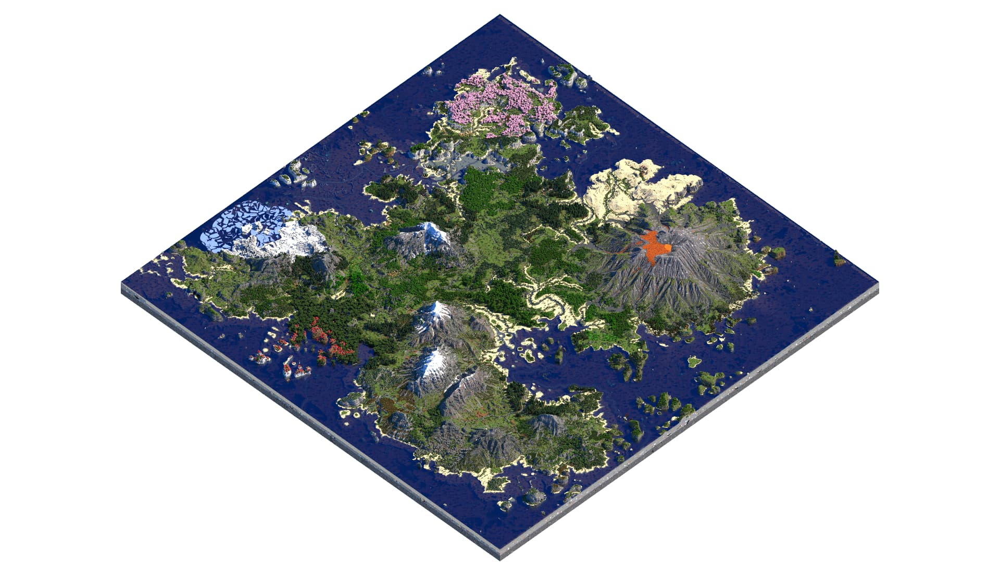
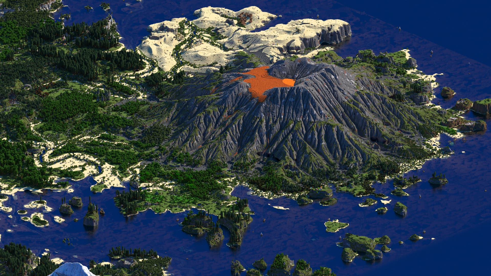
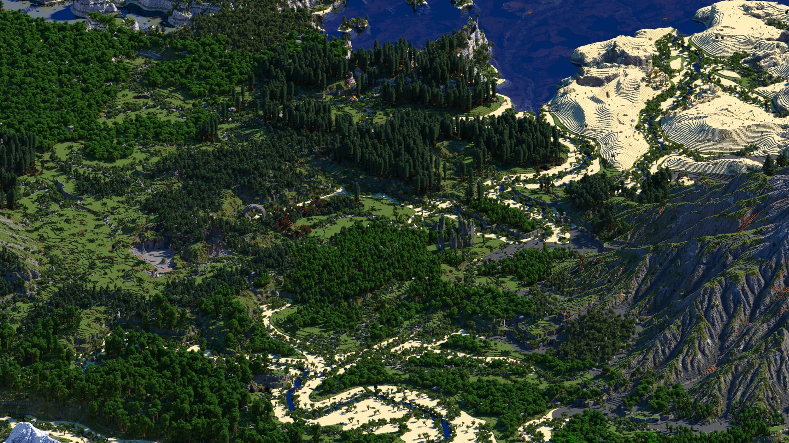
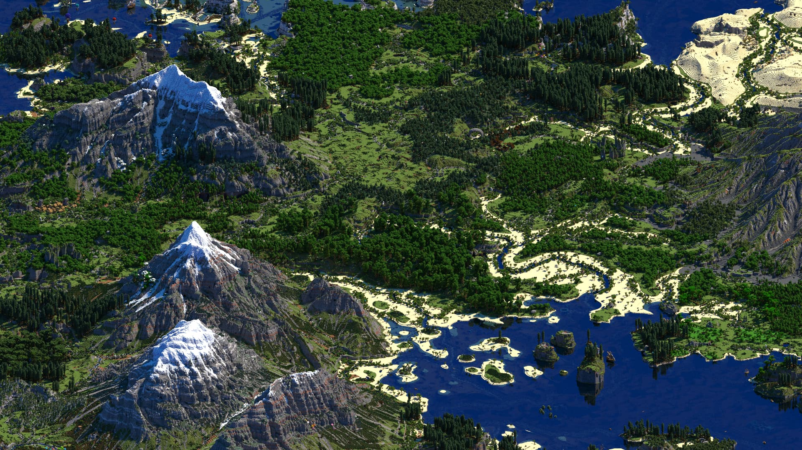
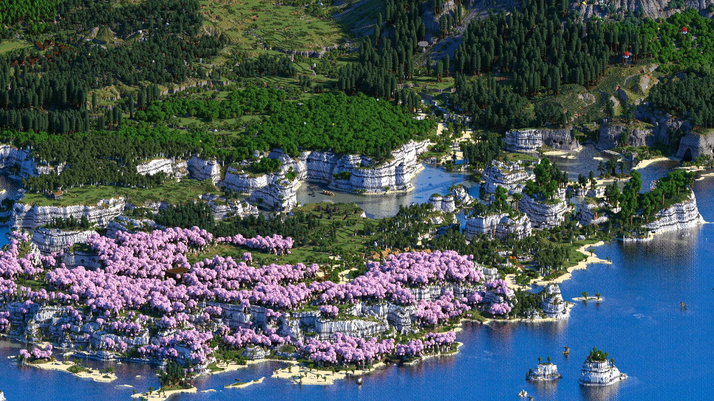

Elazkor,
an great 16km² custom Minecraft map created by McMeddon. A continent, with plenty of coastlines, mountains, new forests and the main focus the new volcano with its magma flows and ash sediments all around it.

Embark on thrilling adventures by plundering forests and balloons, battling through deserts, or constructing your dream home on cliffs or mountains. Discover custom thriving diverse island to explore.

---

Released 	Release date	Type

✅	21. April 2025	Source Files

✅	21. April 2025	1.20.2 Java

✅	22. April 2025	1.21 Bedrock 

---

## Links
> https://www.planetminecraft.com/project/elazkor/

## World Explorer

<!-- <iframe src="https://mcmeddon.github.io/Fetoxion/" width="100%" height="600" frameborder="0" allowfullscreen></iframe> -->

---
## Images

---
