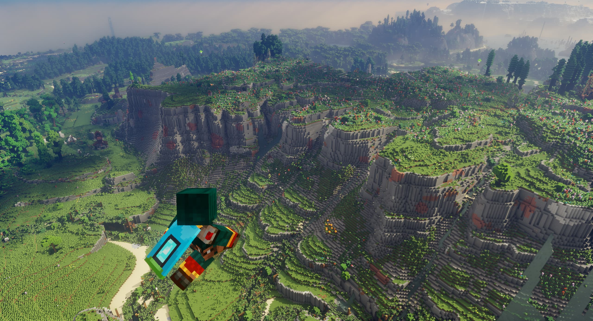
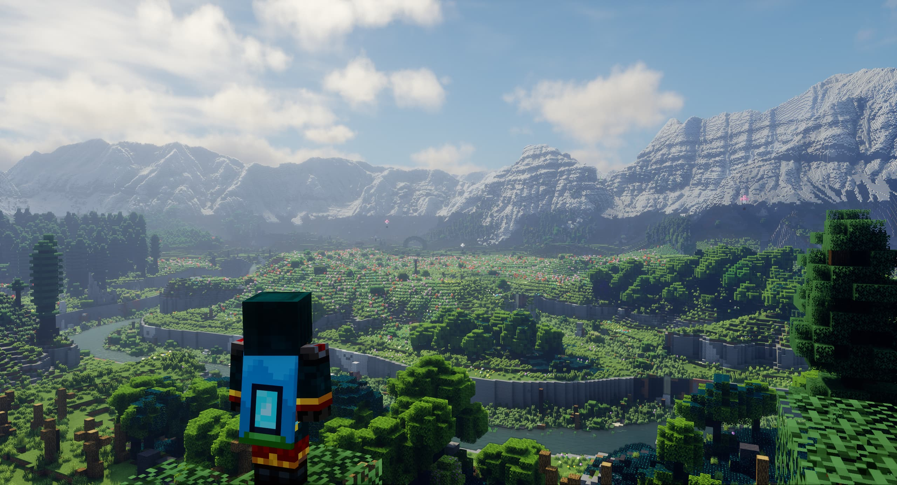
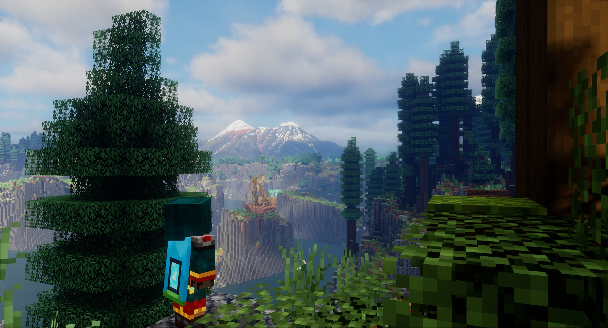
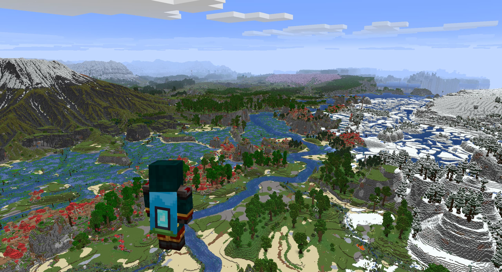
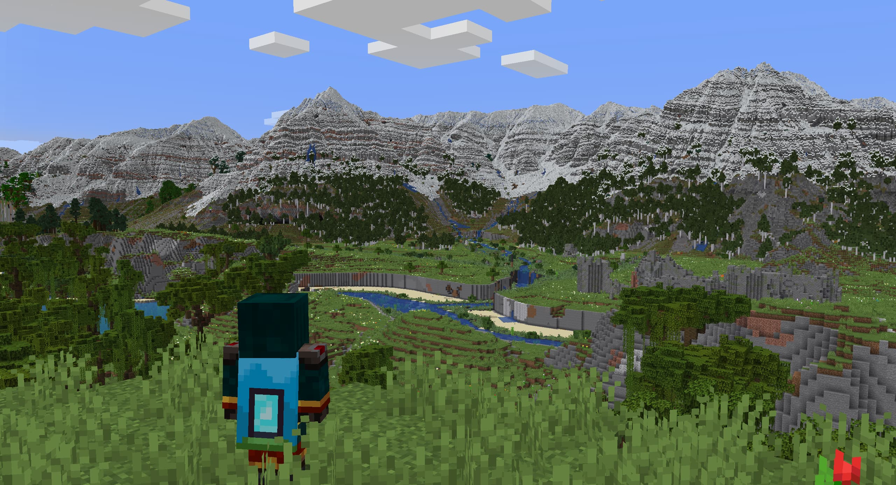

Fetoxion,
an gigantic 64km² custom Minecraft map created by McMeddon. A multi-continental world, surrounded by hundreds of islands, divided by a gigantic mountain range. Also packed with a gigantic Mt. Fuji inspired Volcano, and with wide mix of cliffs, plateaus, mountains, and huge plains.

This project was a huge focus on bringing new terrains, the new biome placement, plains, and the Volcano all together. 

---
## Links
> https://www.planetminecraft.com/project/fetoxion/

> https://www.patreon.com/posts/fetoxion-8k-1-21-127854624

--- 

Released	Release date	Type

✅  	28. April 2025	Source Files

✅ 	28. April 2025	1.21.5 Java

✅  	30. April 2025	1.21 Bedrock

	Predecessor Map (Evolution of:)	www.planetminecraft.com/project/elazkor/
---

## World Explorer

<iframe src="https://mcmeddon.github.io/Fetoxion/" width="100%" height="600" frameborder="0" allowfullscreen></iframe>

---
## Images

---
